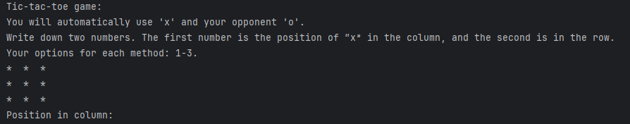
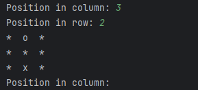
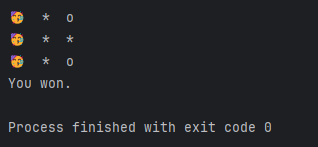

# Tic-Tac-Toe (Java Console Game)

A simple console-based Tic-Tac-Toe game written in Java.
You play as x, and the computer plays as o.
The board uses a 3×3 grid.

## Features

Play Tic-Tac-Toe against a basic computer opponent

Input validation (only numbers 1–3 allowed)

Prevents moves on already-filled spaces

Automatic computer turn after each valid player move

Win detection for both player and computer

Draw detection when the board is full

Winning row highlighted using 🥳 emoji

## How It Works

Game Flow

Player enters a column (1–3) and a row (1–3).

The move is placed if the space is empty.

The game checks for:

A win

A full board (draw)

If the game continues, the computer generates a random valid move.

Board is printed after each turn.

## Screenshots

### Game Start

### Player Move

The computer's move will be generated automatically after the player's move.

### Win Highlight

